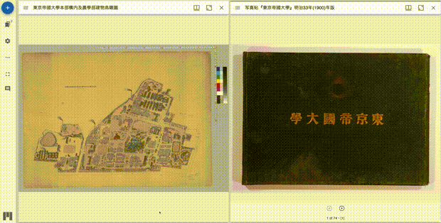
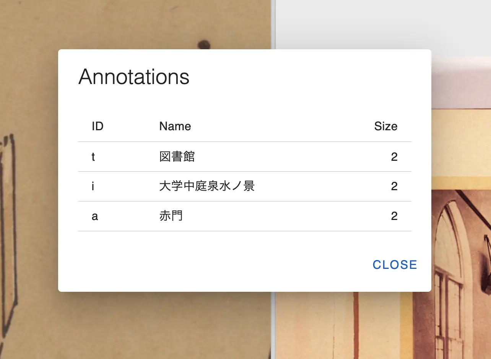

# mirador-compare-plugin

 [](https://zenodo.org/badge/latestdoi/664611010)

`mirador-compare-plugin` is a Mirador 3 plugin that adds functions to compare annotations.

<a href="https://nakamura196.github.io/mirador-compare-plugin/">

</a>

## 🌐 Website

[Visit the demo page](https://nakamura196.github.io/mirador-compare-plugin/) to try it out.

## 📖 Data

Prepare a JSON file with following annotations.

```json
{
  "annotations": [
    {
        "body": {
            "type": "TextualBody",
            "value": "施設: 図書館"
        },
        "id": "https://iiif.dl.itc.u-tokyo.ac.jp/repo/iiif/187cc82d-11e6-9912-9dd4-b4cca9b10970/canvas/p2#xywh=9628/9582/1352/1236",
        "type": "Annotation",
        "motivation": "commenting",
        "target": "https://iiif.dl.itc.u-tokyo.ac.jp/repo/iiif/187cc82d-11e6-9912-9dd4-b4cca9b10970/canvas/p2#xywh=9628,9582,1352,1236",
        "_compare": {
            "id": "t",
            "label": "図書館"
        }
    }
  ]
}
```

The JSON file used on the demo site is as follows.

https://raw.githubusercontent.com/nakamura196/mirador-compare-plugin/main/assets/json/agriculture.json

The `_compare` field is used to compare annotations. The `_compare` field has the following fields.

| Field | Description | 
| ---- | ---- |
| id | Common ID for comparing annotations. |
| label | Label for comparing annotations. |



## 📖 Installation

`mirador-compare-plugin` requires an instance of Mirador 3. See the [Mirador wiki](https://github.com/ProjectMirador/mirador/wiki) for examples of embedding Mirador within an application and additional information about plugins. See the [live demo's index.js](https://github.com/nakamura196/mirador-compare-plugin/blob/main/demo/src/index.js) for an example of importing and configuring `mirador-compare-plugin`.

## Contribute
Mirador's development, design, and maintenance is driven by community needs and ongoing feedback and discussion. Join us at our regularly scheduled community calls, on [IIIF slack #mirador](http://bit.ly/iiif-slack), or the [mirador-tech](https://groups.google.com/forum/#!forum/mirador-tech) and [iiif-discuss](https://groups.google.com/forum/#!forum/iiif-discuss) mailing lists. To suggest features, report bugs, and clarify usage, please submit a GitHub issue.

## Cite as

[](https://zenodo.org/badge/latestdoi/664611010)

The above DOI corresponds to the latest versioned release as [published to Zenodo](https://zenodo.org/records/10449856), where you will find all earlier releases. To cite `mirador-compare-plugin` independent of version, use https://doi.org/10.5281/zenodo.10449856, which will always redirect to the latest release.