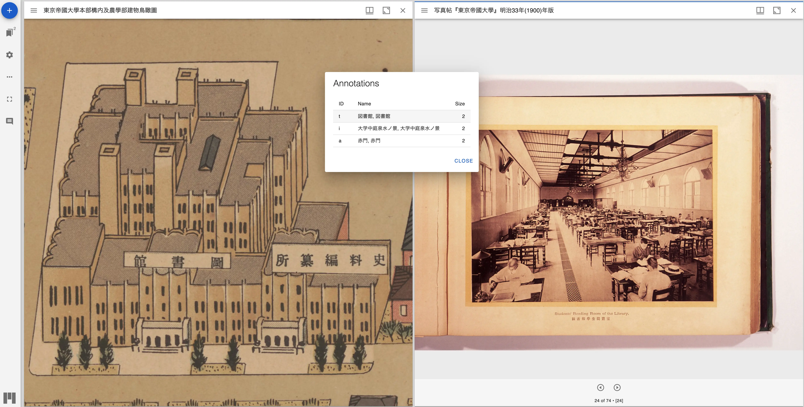

# mirador-compare-plugin

`mirador-compare-plugin` is a Mirador 3 plugin that adds functions to compare annotations.

## 🌐 Website

[Visit the demo page](https://nakamura196.github.io/mirador-comapre-plugin/) to try it out.

## 📖 Installation

`mirador-compare-plugin` requires an instance of Mirador 3. See the [Mirador wiki](https://github.com/ProjectMirador/mirador/wiki) for examples of embedding Mirador within an application and additional information about plugins. See the [live demo's index.js](https://github.com/nakamura196/mirador-compare-plugin/blob/main/demo/src/index.js) for an example of importing and configuring `mirador-compare-plugin`.

## Contribute
Mirador's development, design, and maintenance is driven by community needs and ongoing feedback and discussion. Join us at our regularly scheduled community calls, on [IIIF slack #mirador](http://bit.ly/iiif-slack), or the [mirador-tech](https://groups.google.com/forum/#!forum/mirador-tech) and [iiif-discuss](https://groups.google.com/forum/#!forum/iiif-discuss) mailing lists. To suggest features, report bugs, and clarify usage, please submit a GitHub issue.
